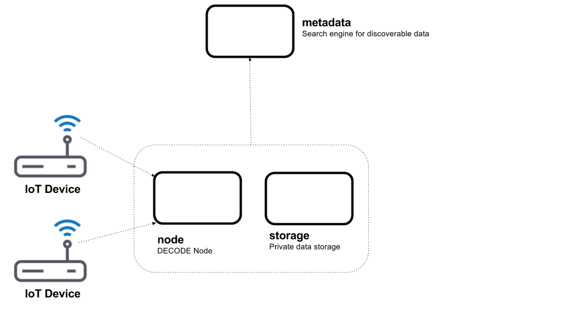

# decode-prototype-da

This repository contains an early stage prototype working demonstrator which is capable of:
- retaining private IoT data
- search
- data entitlement
- decentralised data access

The architectural context for the prototype is based around the discussions in the first 6 months of the
[DECODE project](https://decodeproject.eu/) by the technical partners [Thoughtworks](https://www.thoughtworks.com/), [Dyne](https://www.dyne.org/) and [thingful](https://www.thingful.net). 

The purpose of the prototype is to demonstrate the concepts from the DECODE project grounded in an IoT usecase.

Data Entitlement
----------------

An introduction to concepts of data entitlements as well as a review of prior art was completed as part of the DECODE project.
This document can be found [here](https://desk.dyne.org/s/7gHFaUIoNEFB1Wx#pdfviewer).

For the purposes of the prototype we have defined any singular piece of  data in our system as being in one of three logical states -
- owner-only - the data is not discoverable or accessible.
- can-discover - the data is discoverable and there will be made available for search. The data is not accessible.
- can-access - the data is accessible and by default discoverable.

It is important to note that the prototype does not, by design, implement authentication and as such all entitlements once given are applied globally.

Architecture
------------

The prototype is implemented as a set of HTTP services exposing various endpoints accepting various JSON messages in a REST-like manner.
Each of the services is documented with a [swagger api](https://swagger.io/)

An overview of a single node system.



In this diagram two IoT devices logically direct their data to the node service.
As a convenience we have included fake IoT devices as part of the prototype.
The output of these fake devices correspond to the output of the [device-hub](https://github.com/thingful/device-hub) component as developed by (thingful)[https://thingful.net].

The node service owns an instance of the storage service.
The node has a relationship with the metadata service.

The node service is responsible for:
- maintaining the configuration of data entitlements.
- accepting data from one or more sources - in the prototype this is a selection of IOT devices.
- orchestrating the discoverability and accessibility of the data as per the configured data entitlements.

The node service has a storage service which is responsible for:
- maintaining any saved data points

The node service corresponds to the concept of the DECODE node in the DECODE Architecture whitepaper.
Please note this has not been made public yet.

The metadata service is responsible for:
- maintaining an index of discoverable data and their locations.
- displaying any data that is accessible.
- allow a user to make an entitlement request to access data that is not yet accessible.

Both the node and metadata service expose a user interface.

The architecture is designed to scale with multiple DECODE nodes using a single metadata service.

![multi-node overview] (docs/multi-node.png)


Walkthrough
-----------

TODO


Notes
-----

Please note the following:
- this is a prototype and not production software.
- there is no authentication and or authorisation.
- all data is held in memory - resetting the environment will reset all of the data.

Building
--------

To build the software ensure you have installed the following software :

- Golang 1.7.3+
- Docker and Docker compose
- [Elm]( https://guide.elm-lang.org/install.html) 0.18+


Once you have a working installation download the code using the go get

```
go get gogs.dyne.org/DECODE/decode-prototype-da
```

The makefile contains helpers to build the environment plus some helpers for development.


```
make help
```

To build all of the docker containers locally for docker compose to use

```
make docker-build
```

To run the application components via docker compose

```
docker-compose up
```

The docker-compose tool will then map the ports exposed by the containers to local ports on you own machine.

The ports it will try and use are - 8080, 8081 and 8083. 

If theses ports are already in use the docker-compose tool will display a warning.

The prototype should then be available at the following urls

'node' swagger api - http://localhost:8080/apidocs

'node' ui - http://localhost:8080

'metadata' swagger api - http://localhost:8081/apidocs

'metadata' ui - http://localhost:8081

'storage' swagger api - http://localhost:8083/apidocs


To stop the application components via docker compose you can either type Ctrl-C or from another window issue the command

```
docker-compose down
```

